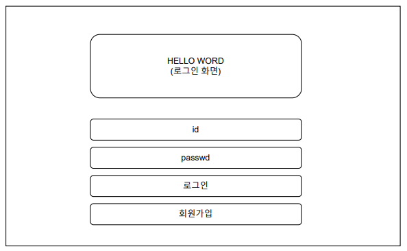
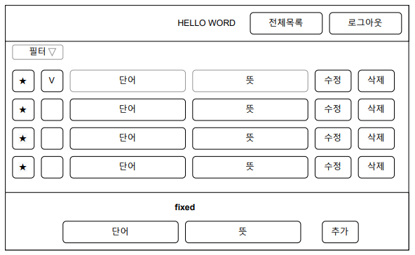

# [항해99 Chapter #1] 1조 S.A(Starting Assignment)

# 프로젝트 개요

- 프로젝트명 : Hello Word
- 내용 : 코딩도 중요하지만, 개발자의 문서는 대부분 영어로 되어 있기에 영어 공부도 빠뜨릴 수 없죠! 간단하게 영어 단어를 암기할 수 있는 나만의 단어장입니다.

# 와이어 프레임

## 로그인 페이지



## 회원가입 페이지


## 단어 리스트 페이지



# API

## 로그인 : POST	/api/login

```js
const callback = {
    request: {
        body: {
            id: String,
            passwd: String
        }
	},
	response: {
        header: {
            Set-Cookie: {
                AccessToken: String
        	}
        },
        data: {
            ok: Boolean,
            message?: String
        }
    }
};
```

## 회원가입 : POST	/api/signup

```js
const callback = {
    request: {
        params: {
            id: String,
            name: String,
            passwd: String
        }
	},
	response: {
        data: {
            ok: Boolean,
            message?: String
        }
    }
};
```

## 로그아웃 : POST	/api/logout

```js
const callback = {
    request: {
        header: {
        	Authorization: "Bearer AccessToken"  
        }
    },
	response: {
        data: {
            ok: Boolean,
            message?: String
        }
    }
};
```

## 단어목록 조회 : GET	/api/words/:params

```js
const callback = {
    request: {
        header: {
        	Authorization: "Bearer AccessToken"  
        },
        params: {
            done?: Boolean,
            star?: Boolean
        }
	},
	response: {
        data: {
            rows: [
                {
                    id: String,
                    word: String,
                    mean: String,
                    done: Boolean,
                    star: Boolean
                }
            ],
            message?: String
        }
    }
};
```

## 단어 추가 : POST	/api/words

```js
const callback = {
    request: {
        header: {
        	Authorization: "Bearer AccessToken"  
        },
        body: {
            word: String,
            mean: String,
            done: Boolean,
            star: Boolean
		}
	},
	response: {
        data: {
            ok: Boolean,
            message?: String
        }
    }
};
```

## 단어 수정 : PUT	/api/words/:params

```js
const callback = {
    request: {
        header: {
        	Authorization: "Bearer AccessToken"  
        },
        params: {
            id: String
		}
        body: {
            word?: String,
            mean?: String,
            done?: Boolean,
            star?: Boolean
		}
	},
	response: {
        data: {
            ok: Boolean,
            message?: String
        }
    }
};
```

## 단어 삭제 : DELETE	/api/words/:params

```js
const callback = {
    request: {
        header: {
        	Authorization: "Bearer AccessToken"  
        },
        params: {
            id: String
		}
	},
	response: {
        data: {
            ok: Boolean,
            message?: String
        }
    }
};
```

# 필수조건

- jinja2 템플릿 엔진을 이용한 서버사이드 렌더링 적용 : 장점 파악
- JWT 인증 방식 로그인 기능 구현 : 세션/쿠키 방식과의 차이점 및 장단점 파악

# Git Repo

- https://github.com/fomula91/HelloWord/tree/main

# 팀원

- 최원영(팀장) : https://github.com/choewy
- 하상우 : https://github.com/
- 홍승민 : https://github.com/
- 김형중 : https://github.com/fomula91