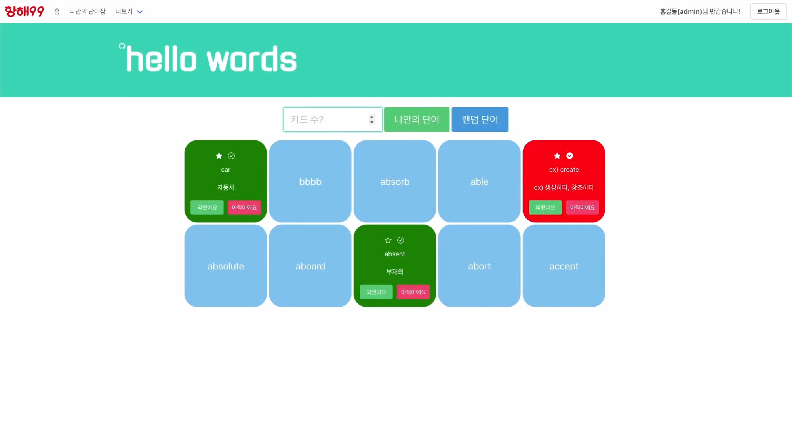

# 항해99 Chapter 1 - 팀별 미니 프로젝트(1조)

## 1. Preview

 

## 2. Note

<ul>
  <li>
    

      

        <b>Tags</b>
      

      

        <ul>
          <a href="https://choewy.tistory.com/125"
            ><li>S.A(Start Assignment)</li></a
          >
          <a href="https://github.com/fomula91/HelloWord/tree/v1.0.0-test"
            ><li>v1.0.0-test</li></a
          >
          <a
            href="https://github.com/fomula91/HelloWord/tree/v1.0.2-first-merge"
            ><li>v1.0.2-first-merge</li></a
          >
          <a href="https://github.com/fomula91/HelloWord/tree/v1.0.3-complete"
            ><li>v1.0.3-complete</li></a
          >
          <a href="https://github.com/fomula91/HelloWord/tree/v1.0.4-refectory"
            ><li>v1.0.4-refectory</li></a
          >
          <a href="https://github.com/fomula91/HelloWord/tree/v1.0.5-final"
            ><li>v1.0.5-final</li></a
          >
        </ul>
      

    

  </li>
  <li>
    

      

        <b>Dependencies</b>
      

      

        <ul>
          <li>flask</li>
          <li>pymongo</li>
          <li>PyJWT</li>
          <li>configparser</li>
          <li>certifi</li>
        </ul>
      

    

  </li>
</ul>

## 3. Role

<ul>
  <li>
    

      

        <b>최원영</b>
      

      

        <ul>
          <li>단어 조회 페이지 구현</li>
          <li>전체 기능 검토 및 통합</li>
          <li>Repo 관리, 리팩토링</li>
        </ul>
      

    

  </li>
  <li>
    

        

          <b>하상우</b>
        

        

          <ul>
            <li>회원가입, 로그인 페이지 구현</li>
            <li>회원 인증 API 구현</li>
          </ul>
        

      </li>
	<li>
	

    

      <b>홍승민</b>
    

    

      <ul>
        <li>단어 퀴즈 페이지 구현</li>
        <li>단어 수정 및 삭제 API 구현</li>
        <li>서버 배포 및 관리</li>
      </ul>
    

  

  <li>
    

      

        <b>김형중</b>
      

      

        <ul>
          <li>단어 조회 API 구현</li>
          <li>단어 등록 API 구현</li>
          <li>커스텀 Alert 구현</li>
        </ul>
      

    

  </li>
</ul>

## 4. Log

<ul>
    <li>
  

    

      <b>1일차 : 03.07(월)</b>
    

    

      <ul>
        <li>주제 선정 및 기능 정의</li>
        <li>템플릿 구성, DB 스키마 및 API 설계</li>
        <li>테스트 버전 구현 (템플릿 : 김형중, 하상우 / API : 최원영, 홍승민)</li>
        <li>점검 및 코드 리뷰 진행</li>
      </ul>
    

  

</li>
<li>
  

      

        <b>2일차 : 03.08(화)</b>
      

      

        <ul>
          <li>세부 내용 설계 및 로직 확정</li>
          <li>역할 분담</li>
          <li>JWT 사용자 인증, 인가 기능 구현</li>
          <li>전체 템플릿 구현 완료</li>
        </ul>
      

    </li>
  <li>
  

  

    <b>3일차 : 03.09(수)</b>
  

  

    <ul>
      <li>중간 점검 및 코드 리뷰 진행</li>
      <li>전체 기능 구현 완료</li>
      <li>코드 병합</li>
    </ul>
  

<li>
  

    

      <b>4일차 : 03.10(목)</b>
    

    

      <ul>
        <li>MVC 패턴으로 구조 변경</li>
        <li>유저의 이름(아이디) 표시</li>
        <li>커스텀 Alert 적용</li>
        <li>최종 검토</li>
        <li>시연 영상 촬영 및 편집</li>
        <li>이슈 사항 정리 및 회고</li>
      </ul>
    

  

</li>
</ul>
